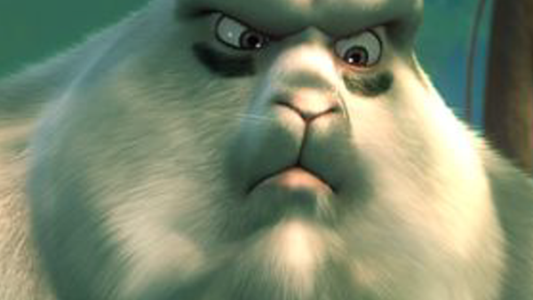

# NeuralHolography
Computer Generated Hologram using Deep Neural Network

Run main.py to get started.
The files in the data folder are used for training. The files are rescaled to the resolution specified in the file.

An example image and its reconstruction is shown below:

  
  

